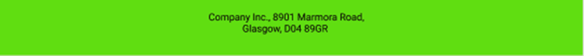

# Exercícios: Criação de Projeto React, Componentização II e
Dinamismo

**1 -** Crie um projeto React.js com typescript(pesquisar linha de comando), com o nome
‘eventos'. Exclua os arquivos que não serão utilizados e cria as pastas assets, pages e
components (com as pastas css). Pesquise como é criado um projeto React com typescript.

**2 -** No projeto 'eventos' crie os componentes header e footer, conforme estilizaçao do
arquivo figma:
[https://www.figma.com/file/pZXlah3MvitCpY6G2RKMhB/Exercícios-FrontEnd?node-id=0%3A1](https://www.figma.com/file/pZXlah3MvitCpY6G2RKMhB/Exerc%C3%ADcios-FrontEnd?node-id=0%3A1)

**HOME**

**FOOTER**

**3 -** No projeto 'eventos' crie a página home conforme estilização do arquivo figma:
[https://www.figma.com/file/pZXlah3MvitCpY6G2RKMhB/Exercícios-FrontEnd?node-id=0%3A1](https://www.figma.com/file/pZXlah3MvitCpY6G2RKMhB/Exerc%C3%ADcios-FrontEnd?node-id=0%3A1)

4 **-** No projeto 'eventos' crie a página eventos conforme estilização do arquivo figma:
[https://www.figma.com/file/pZXlah3MvitCpY6G2RKMhB/Exercícios-FrontEnd?node-id=0%3A1](https://www.figma.com/file/pZXlah3MvitCpY6G2RKMhB/Exerc%C3%ADcios-FrontEnd?node-id=0%3A1)

**5 -** No projeto 'eventos' crie a responsividade das paginas criadas para smartphone
conforme estilizaçao do arquivo figma:
[https://www.figma.com/file/pZXlah3MvitCpY6G2RKMhB/Exercícios-FrontEnd?node-id=0%3A1](https://www.figma.com/file/pZXlah3MvitCpY6G2RKMhB/Exerc%C3%ADcios-FrontEnd?node-id=0%3A1)

**6 -** No projeto 'eventos’, utilize props para adicionar títulos distintos no
componente header, conforme descrição abaixo:

**Título da home:** ‘Seja bem vindo a nossa página de Eventos’

**Título da eventos:** ‘Cadastre um evento!’

**7 -** No projeto de Eventos, crie um componente chamado “Evento”, passando os
valores para cada evento listado:

**Exemplos:**
*Lolapalooza - Show*
*A Família Adams - Musical*

**8 -** No projeto 'bolosjulia’ da lista anterior, utilize props para adicionar títulos
distintos no componente header, conforme descrição abaixo:

**HEADER**

**Título da home:**
‘Seja bem vindo ao bolos Júlia’
**Título da sobre:**
‘Conheça nossa história e como chegamos até aqui’
**Título da bolos:**
‘Cadastre bolos e visualize todos os sabores oferecidos’

**9 -** No projeto 'vagas' da lista anterior, utilize props para adicionar títulos
distintos no componente header, conforme descrição abaixo:

**Título da perfil:**
'Cadastre e liste usuários do FindVagas ’
**Título da vagas:**
‘Veja todas as vagas oferecidas’
**Título da bolos:**
‘Cadastre-se nas vagas de sua preferência’